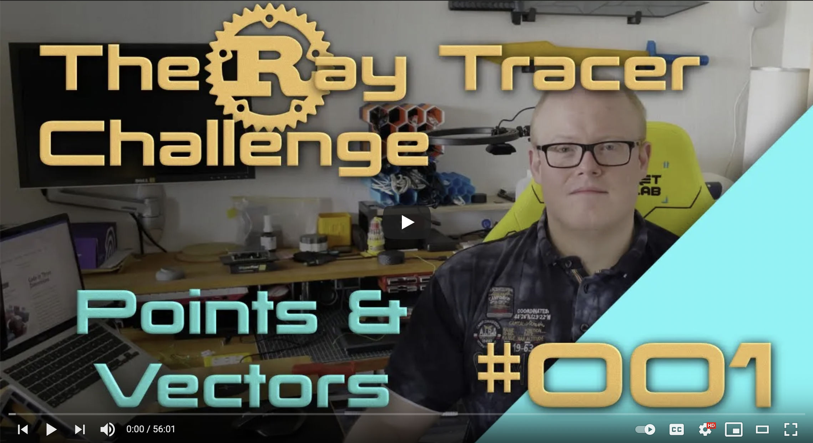

# The Ray Tracer Challenge

This repository contains all the code written, while step by implementing Ray
Tracer, based on the book ["The Ray Tracer Challenge" by Jamis Buck](http://www.raytracerchallenge.com/), which
presents the concept in fully test driven way.

I am implementing all the chapters of this book in Rust, a language I wanted to
learn for quite some time, but never got the time or the right project for.
I have never written anything in Rust before, so please bear with me, if the
code isn't perfect.

I furthermore decided to create [a YouTube series](https://www.youtube.com/playlist?list=PLy68GuC77sUTyOUvDhVboQoOlHoa4XrSO) of me learning Rust and having
some fun, while implementing chapter by chapter of the book. You are [welcome to
join
me](https://www.youtube.com/playlist?list=PLy68GuC77sUTyOUvDhVboQoOlHoa4XrSO) and follow allow while I am working on this week for week.

## What has been implemented so far?

- [X] Chapter 01: Tuples, Points, and Vectors
- [X] Chapter 02: Drawing on a Canvas
- [X] Chapter 03: Matrices
- [X] Chapter 04: Matrix Transformations
- [X] Chapter 05: Ray-Sphere Intersections
- [X] Chapter 06: Light and Shading
- [X] Chapter 07: Making a Scene
- [X] Chapter 08: Shadows
- [ ] Chapter 09: Planes
- [ ] Chapter 10: Patterns
- [ ] Chapter 11: Reflection and Refraction
- [ ] Chapter 12: Cubes
- [ ] Chapter 13: Cylinders
- [ ] Chapter 14: Groups
- [ ] Chapter 15: Triangles
- [ ] Chapter 15: Constructive Solid Geometry (CSG)
